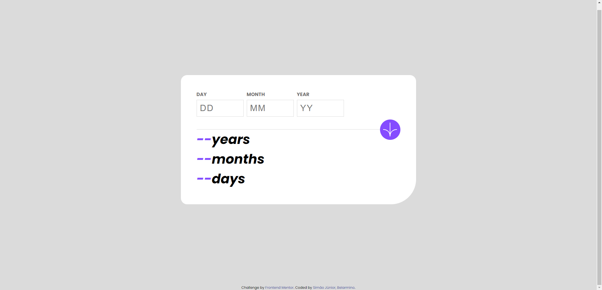

# Age Calculator App

This is a solution to the [Age Calculator App Challenge on Frontend Mentor](https://www.frontendmentor.io/challenges/age-calculator-app-dF9DFFpj-Q/hub). Frontend Mentor challenges help you improve your coding skills by building realistic projects.

## OVERVIEW

### DEMO

### LINKS

- Solution URL: [Solution URL](https://github.com/belarminojunior/Age-Calculator-App)
- Live URL: [Live URL](https://age-calculator-app-self-tau.vercel.app/)

## THE PROCESS

### BUILT WITH

- Semantic HTML5 markup
- CSS custom properties
- Flexbox
- JavaScript

## AUTHOR

- Instagram - [Belarmino Simão, Jr](https://www.instagram.com/wonderr____/)
- Frontend Mentor - [@belarminojunior](https://www.frontendmentor.io/profile/belarminojunior)
- Twitter - [@belarmino\_\_jr](https://twitter.com/belarmino__jr)
